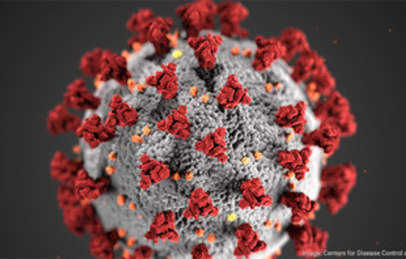
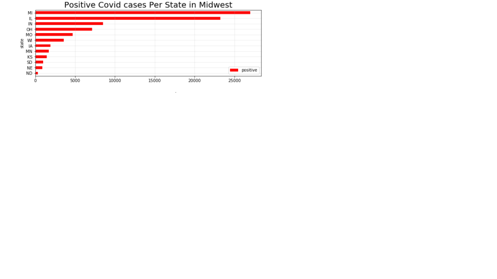
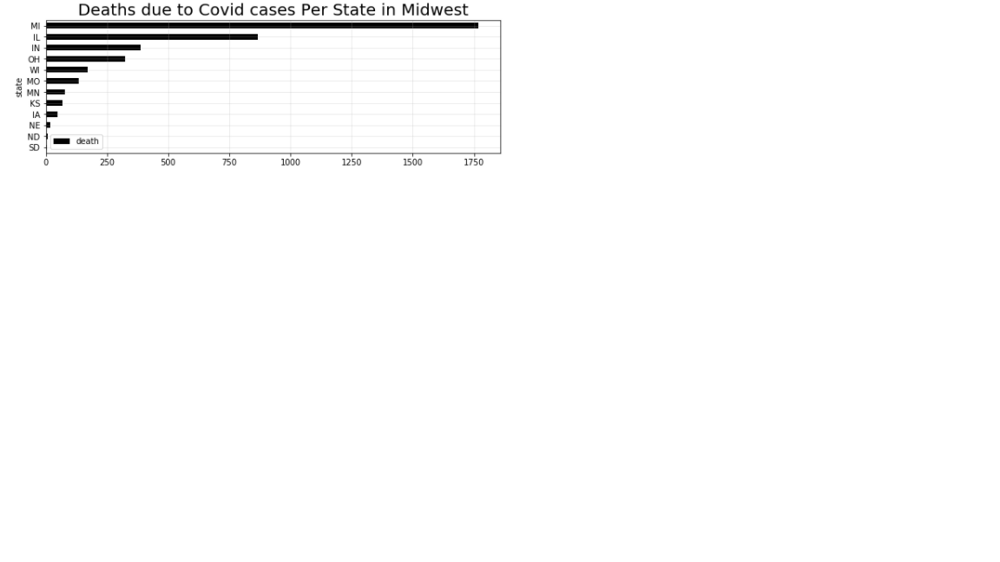
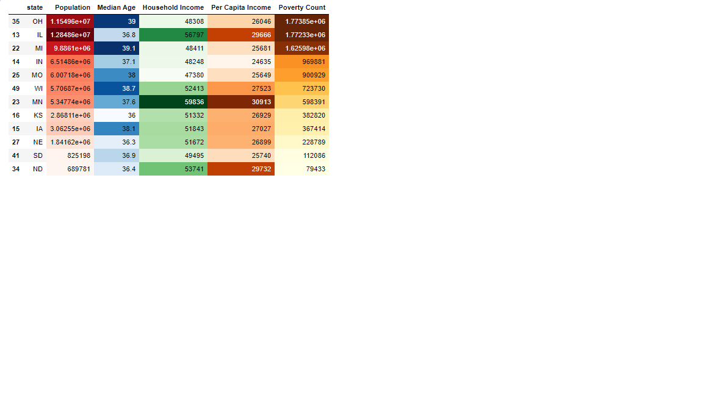

# What factors associate with COVID-19 spread?

  1. Are some racial groups are more vulnerable?
  2. Is poverty also a factor?

Instead of focusing on just Illinois, we decided to study all 12 states in midwest to expand the project scope.
We can analyse multiple datasets to understand this much better, like the John Hopkins Covid Dataset and the  Census Data. 

## Analysis

At the state level, Michigan has the highest positive cases and deaths.

There is a moderately strong positive correlation between death rate, positive covid rate and poverty.
Looking at the data overtime, we saw a jump in positive covid case numbers after Apr 3rd 2020, which could be due to the increasing testing.
For the average poverty rate in midwest states at the county level, Missouri has the highest.
By checking the distribution of positive covid cases and death in midwest states at county level, we found Michigan and Illinois have the most extreme outliers.
We found strong positive correlation between posivite covid cases, deaths and poverty count at the county level in midwest, which is consistant with the state level
